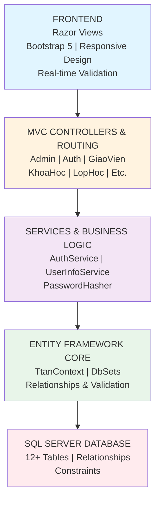
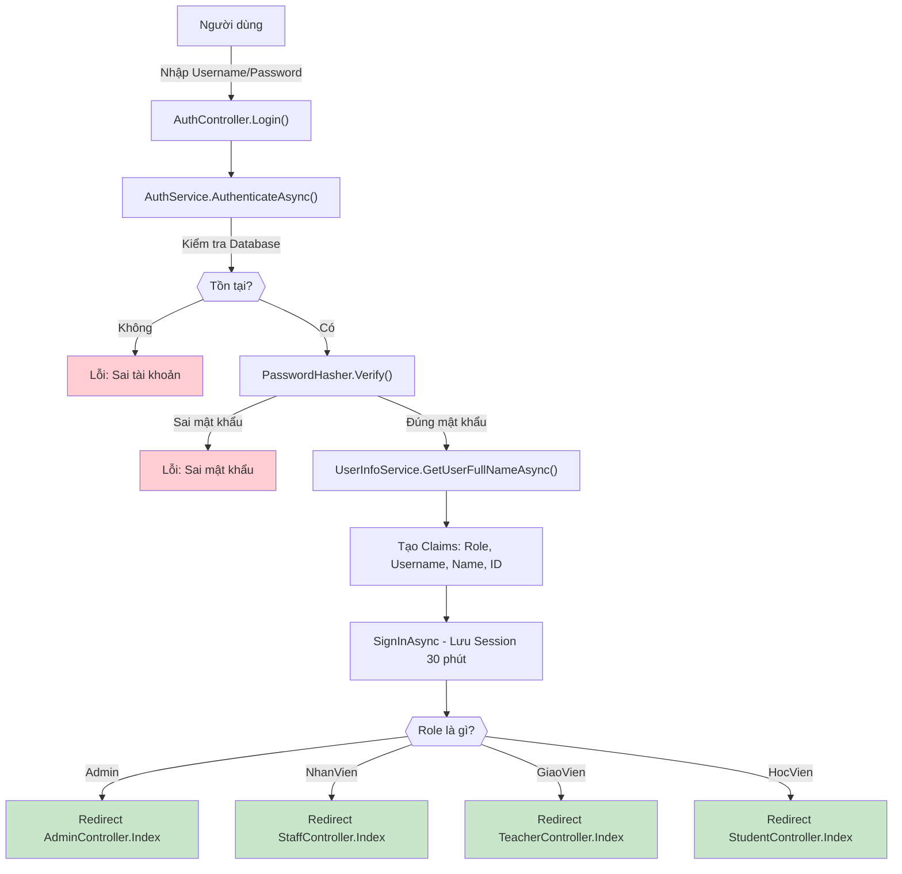
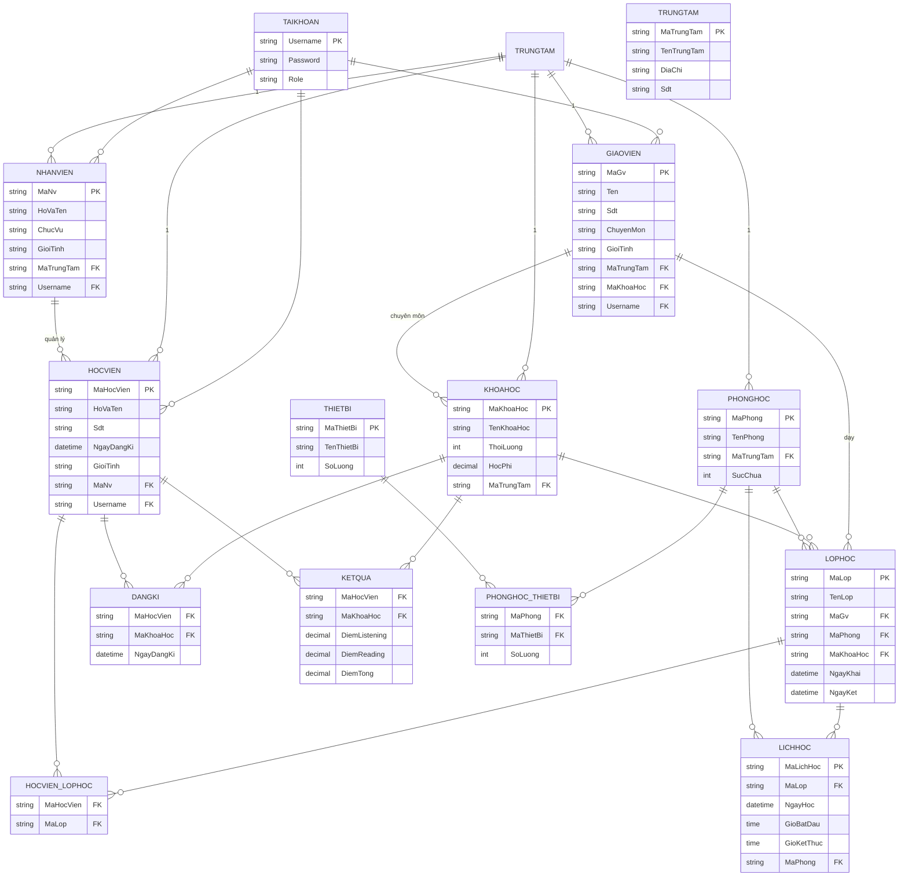
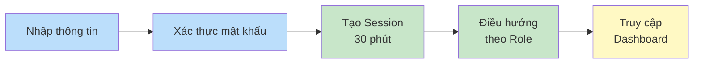
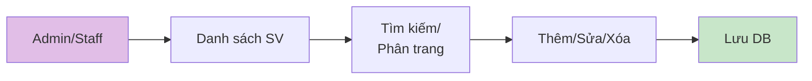
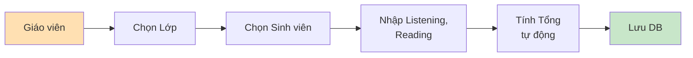
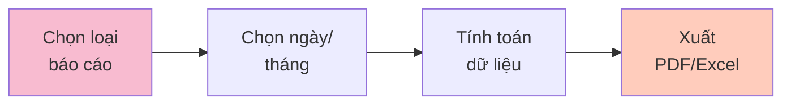

# 5.3. THIẾT KẾ HỆ THỐNG

## I. TỔNG QUAN KIẾN TRÚC HỆ THỐNG

Hệ thống Quản lý Trung tâm Đào tạo (BTL-Web) được xây dựng theo mô hình **MVC (Model-View-Controller)** sử dụng nền tảng **ASP.NET Core** với cơ sở dữ liệu **SQL Server**. Hệ thống hỗ trợ 4 vai trò chính: Admin, Nhân viên, Giáo viên, và Học viên.

### Kiến trúc hệ thống:



---

## II. PHÂN TÍCH THIẾT KẾ CÁC MODULE CHÍNH

### A. MODULE QUẢN LÝ TÀI KHOẢN & ĐĂNG NHẬP

**Chức năng chính:**
- Đăng nhập an toàn với mã hóa mật khẩu (Password Hashing)
- Phân quyền theo 4 vai trò: Admin, Nhân viên, Giáo viên, Học viên
- Lưu session với timeout 30 phút
- Quản lý hồ sơ người dùng (cập nhật thông tin, upload ảnh)
- Thay đổi mật khẩu an toàn

**Giao diện:**
- **Trang Đăng nhập** - Form nhập Username/Password với xác thực phía client
- **Trang Hồ sơ Cá nhân** - Hiển thị thông tin người dùng kèm ảnh đại diện
- **Trang Chỉnh sửa Hồ sơ** - Form cập nhật thông tin, upload ảnh

**Luồng xác thực:**


---

### B. MODULE QUẢN LÝ SINH VIÊN (Admin/Staff)

**Chức năng chính:**
- Hiển thị danh sách sinh viên với **phân trang** (10-50 sinh viên/trang)
- **Tìm kiếm** theo Mã Sinh viên hoặc Họ tên
- **Thêm** sinh viên mới (tự động tạo Mã SV)
- **Sửa** thông tin sinh viên (tên, số điện thoại, giới tính, quản lý bởi)
- **Xóa** sinh viên (Cascade: xóa đăng ký, kết quả)
- **Xem chi tiết** sinh viên (khóa học đã đăng ký, kết quả học tập)

**Giao diện:**
- **Danh sách Sinh viên** - Table với 100+ hàng, pagination, search bar, action buttons (Edit/Delete/View)
- **Form Thêm/Sửa Sinh viên** - Input: Họ tên, Số ĐT, Giới tính, Quản lý bởi (dropdown)
- **Chi tiết Sinh viên** - Card hiển thị thông tin, bảng khóa học đăng ký, bảng kết quả

**Dữ liệu hiển thị:**
```
┌──────────────────┬────────┬─────┬──────────────────┬───────────────┐
│ Mã Sinh viên     │ Họ tên │ SĐT │ Quản lý bởi       │ Hành động      │
├──────────────────┼────────┼─────┼──────────────────┼───────────────┤
│ SV001            │ Nguyễn A│0987│ Nhân viên 1       │ [Edit][Delete]│
│ SV002            │ Trần B  │0988│ Nhân viên 2       │ [Edit][Delete]│
│ ...              │ ...    │...  │ ...              │ ...           │
└──────────────────┴────────┴─────┴──────────────────┴───────────────┘
```

---

### C. MODULE QUẢN LÝ GIÁO VIÊN

**Chức năng chính:**
- Danh sách giáo viên với tìm kiếm
- Thêm/Sửa/Xóa giáo viên
- Quản lý chuyên môn (Khóa học dạy)
- Xem lịch dạy (Lớp học, Phòng học, Thời gian)
- Nhập/Sửa điểm sinh viên

**Giao diện:**
- **Danh sách Giáo viên** - Table hiển thị: Mã GV, Họ tên, Chuyên môn, Số ĐT, Hành động
- **Form Thêm/Sửa Giáo viên** - Input: Họ tên, Chuyên môn, Số ĐT, Giới tính
- **Chi tiết Giáo viên** - Thông tin cá nhân, danh sách lớp dạy, đánh giá

**Bảng Quản lý Giáo viên:**
```
┌──────────┬───────────┬──────────────────┬──────┬─────────────┐
│ Mã GV    │ Họ tên    │ Chuyên môn       │ SĐT  │ Hành động   │
├──────────┼───────────┼──────────────────┼──────┼─────────────┤
│ GV001    │ Võ Quốc A │ Tiếng Anh Phổ    │0989  │ [Edit][Xóa] │
│ GV002    │ Lê Thị B  │ IELTS Intensive  │0990  │ [Edit][Xóa] │
└──────────┴───────────┴──────────────────┴──────┴─────────────┘
```

---

### D. MODULE QUẢN LÝ KHÓA HỌC

**Chức năng chính:**
- Danh sách khóa học (với tìm kiếm)
- Thêm/Sửa khóa học (tên, thời lượng, học phí)
- Xem chi tiết khóa học (danh sách lớp, sinh viên đăng ký)
- Quản lý giáo viên dạy khóa học
- Báo cáo doanh thu khóa học

**Giao diện:**
- **Danh sách Khóa học** - Card view hoặc Table: Tên khóa, Thời lượng, Học phí, Trạng thái, Hành động
- **Form Thêm/Sửa Khóa học** - Input: Tên, Thời lượng (giờ), Học phí (VND), Mô tả
- **Chi tiết Khóa học** - Thông tin chung, danh sách lớp học, sinh viên đăng ký, doanh thu

**Thông tin Khóa học:**
```
┌─────────────────────────────────────────────────────────┐
│ Khóa học: IELTS Intensive - 6 Tuần (60 giờ)            │
├─────────────────────────────────────────────────────────┤
│ Học phí: 6,000,000 VND                                 │
│ Trạng thái: Đang diễn ra (5/20 lớp)                   │
│ Lớp học: 5 lớp                                         │
│ Sinh viên đăng ký: 85 em                               │
│ Doanh thu ước tính: 510,000,000 VND                    │
└─────────────────────────────────────────────────────────┘
```

---

### E. MODULE QUẢN LÝ LỚP HỌC

**Chức năng chính:**
- Danh sách lớp học (phân trang, tìm kiếm)
- Thêm/Sửa lớp học (tên, giáo viên, phòng, khóa học)
- Quản lý sinh viên trong lớp (thêm/xóa)
- Xem lịch học (ngày, giờ, phòng)
- Xem danh sách sinh viên, điểm số

**Giao diện:**
- **Danh sách Lớp học** - Table: Mã lớp, Tên lớp, Giáo viên, Khóa học, Sĩ số, Hành động
- **Form Tạo/Sửa Lớp** - Dropdown chọn Giáo viên, Khóa học, Phòng học; Input tên lớp
- **Chi tiết Lớp** - Thông tin lớp, danh sách sinh viên (kèm điểm), lịch học

**Bảng Lớp học:**
```
┌────────┬────────────────┬──────────────┬────────────┬─────┬──────────────┐
│ Mã Lớp │ Tên Lớp        │ Giáo viên    │ Khóa học   │ Sĩ số│ Hành động    │
├────────┼────────────────┼──────────────┼────────────┼─────┼──────────────┤
│ L001   │ IELTS A1       │ Võ Quốc A    │ IELTS 6W   │ 20  │ [Edit][Xem]  │
│ L002   │ IELTS A2       │ Lê Thị B     │ IELTS 6W   │ 22  │ [Edit][Xem]  │
│ L003   │ TOEIC Standard │ Trần C       │ TOEIC 8W   │ 18  │ [Edit][Xem]  │
└────────┴────────────────┴──────────────┴────────────┴─────┴──────────────┘
```

**Danh sách Sinh viên trong Lớp:**
```
┌────────┬──────────────┬─────────┬──────────┬──────────┬─────┐
│ Mã SV  │ Họ tên       │ Listening│ Reading  │ Tổng điểm│ Xóa │
├────────┼──────────────┼─────────┼──────────┼──────────┼─────┤
│ SV001  │ Nguyễn A     │ 8.0     │ 7.5      │ 15.5     │ [Xóa] │
│ SV002  │ Trần B       │ 7.5     │ 8.0      │ 15.5     │ [Xóa] │
└────────┴──────────────┴─────────┴──────────┴──────────┴─────┘
```

---

### F. MODULE QUẢN LÝ PHÒNG HỌC & THIẾT BỊ

**Chức năng chính:**
- Danh sách phòng học
- Thêm/Sửa phòng (tên, sức chứa, trung tâm)
- Gán thiết bị cho phòng (Projector, Bảng trắng, PC, v.v.)
- Xem chi tiết phòng (thiết bị có sẵn, lịch sử sử dụng)
- Quản lý thiết bị (Thêm/Sửa thiết bị, số lượng)

**Giao diện:**
- **Danh sách Phòng học** - Table: Mã phòng, Tên phòng, Sức chứa, Trung tâm, Thiết bị, Hành động
- **Chi tiết Phòng** - Thông tin phòng, danh sách thiết bị, lịch sử sử dụng, lớp học dạy
- **Quản lý Thiết bị** - Table: Tên thiết bị, Số lượng, Phòng đặt, Tình trạng

**Bảng Phòng học:**
```
┌──────────┬──────────────┬──────────┬────────────┬────────────────────┐
│ Mã phòng │ Tên phòng    │ Sức chứa │ Trung tâm  │ Thiết bị            │
├──────────┼──────────────┼──────────┼────────────┼────────────────────┤
│ P001     │ Phòng A1     │ 30       │ Trung tâm 1│ Projector, PC, Bảng│
│ P002     │ Phòng A2     │ 25       │ Trung tâm 1│ Projector, Bảng    │
│ P003     │ Lab Ngôn ngữ │ 20       │ Trung tâm 2│ 20 PC, Headset     │
└──────────┴──────────────┴──────────┴────────────┴────────────────────┘
```

---

### G. MODULE QUẢN LÝ KẾT QUẢ HỌC TẬP

**Chức năng chính:**
- Hiển thị danh sách kết quả (theo lớp hoặc khóa học)
- Giáo viên nhập điểm (Listening, Reading)
- Tính tổng điểm tự động (Listening + Reading)
- Sửa/Xóa kết quả
- Xuất báo cáo kết quả (theo lớp, khóa học)
- Sinh viên xem kết quả cá nhân

**Giao diện:**
- **Danh sách Kết quả** - Table: Sinh viên, Khóa học, Listening, Reading, Tổng điểm, Hành động
- **Form Nhập/Sửa Điểm** - Input: Listening (0-9), Reading (0-9); Tự động tính tổng
- **Báo cáo Kết quả** - Thống kê: trung bình điểm, số sinh viên đạt/không đạt

**Bảng Kết quả Học tập:**
```
┌────────┬──────────────┬────────────────┬──────────┬─────────┬─────────────┐
│ Mã SV  │ Họ tên       │ Khóa học       │ Listening│ Reading │ Tổng điểm   │
├────────┼──────────────┼────────────────┼──────────┼─────────┼─────────────┤
│ SV001  │ Nguyễn A     │ IELTS 6W       │ 8.0      │ 7.5     │ 15.5      │
│ SV002  │ Trần B       │ IELTS 6W       │ 7.5      │ 8.0     │ 15.5      │
│ SV003  │ Lê C         │ IELTS 6W       │ 6.0      │ 5.5     │ 11.5      │
└────────┴──────────────┴────────────────┴──────────┴─────────┴─────────────┘
```

---

### H. MODULE QUẢN LÝ ĐĂNG KÝ KHÓA HỌC

**Chức năng chính:**
- Sinh viên đăng ký khóa học (online)
- Admin xem/phê duyệt đăng ký
- Tự động tạo bản ghi kết quả khi đăng ký
- Xóa đăng ký (hủy khóa học)
- Báo cáo đăng ký (thống kê sinh viên, doanh thu)

**Giao diện:**
- **Danh sách Đăng ký** - Table: Sinh viên, Khóa học, Ngày đăng ký, Trạng thái, Hành động
- **Chi tiết Đăng ký** - Thông tin sinh viên, khóa học, lịch học, học phí
- **Form Đăng ký** - Chọn khóa học, xác nhận ngày bắt đầu

**Thông tin Đăng ký:**
```
┌──────────────────────────────────────────────────────┐
│ Đăng ký Khóa học: IELTS Intensive 6 Tuần            │
├──────────────────────────────────────────────────────┤
│ Sinh viên: Nguyễn Văn A (SV001)                     │
│ Khóa học: IELTS Intensive 6W - 60 giờ              │
│ Học phí: 6,000,000 VND                             │
│ Ngày đăng ký: 15/04/2026                           │
│ Ngày bắt đầu: 20/04/2026                           │
│ Trạng thái: Đã duyệt                             │
└──────────────────────────────────────────────────────┘
```

---

### I. MODULE QUẢN LÝ NHÂN VIÊN

**Chức năng chính:**
- Danh sách nhân viên (phân trang, tìm kiếm)
- Thêm/Sửa/Xóa nhân viên
- Quản lý chức vụ (Trưởng phòng, Nhân viên hành chính, v.v.)
- Gán sinh viên cho nhân viên quản lý
- Xem sinh viên được quản lý

**Giao diện:**
- **Danh sách Nhân viên** - Table: Mã NV, Họ tên, Chức vụ, Trung tâm, Hành động
- **Form Thêm/Sửa Nhân viên** - Input: Họ tên, Chức vụ, Giới tính, Trung tâm
- **Chi tiết Nhân viên** - Thông tin cá nhân, danh sách sinh viên quản lý

---

### J. MODULE BÁO CÁO

**Chức năng chính:**
- **Báo cáo Doanh thu** (theo khóa học, ngày, tháng)
- **Báo cáo Sinh viên** (theo trung tâm, khóa học, nhân viên quản lý)
- **Báo cáo Giáo viên** (lớp dạy, sinh viên, kết quả)
- **Thống kê Trung tâm** (tổng SV, GV, lớp, doanh thu)
- Xuất báo cáo (PDF, Excel)

**Giao diện:**
- **Trung tâm Báo cáo** - Bảng chọn loại báo cáo (Doanh thu, Sinh viên, Giáo viên, v.v.)
- **Báo cáo Doanh thu** - Biểu đồ/Table: Khóa học, Tháng, Doanh thu, So sánh kỳ trước
- **Báo cáo Sinh viên** - Table: Tên SV, Khóa học đăng ký, Trạng thái, Kết quả

**Bảng Báo cáo Doanh thu:**
```
┌─────────────────────────┬──────────┬─────────────────┬───────────┐
│ Khóa học                │ Sinh viên│ Học phí (VND)   │ Doanh thu │
├─────────────────────────┼──────────┼─────────────────┼───────────┤
│ IELTS Intensive 6W      │ 85       │ 6,000,000       │ 510,000K  │
│ TOEIC Standard 8W       │ 60       │ 5,000,000       │ 300,000K  │
│ GENERAL ENGLISH 12W     │ 120      │ 4,000,000       │ 480,000K  │
├─────────────────────────┼──────────┼─────────────────┼───────────┤
│ TỔNG CỘNG               │ 265      │                 │ 1,290,000K│
└─────────────────────────┴──────────┴─────────────────┴───────────┘
```

---

### K. MODULE DASHBOARD THEO ROLE

#### **Admin Dashboard**
- Thống kê tổng: Số sinh viên, giáo viên, lớp, nhân viên
- Doanh thu tháng này, tháng trước
- Biểu đồ: Doanh thu theo tháng, sinh viên theo khóa học
- Quick actions: Thêm SV, GV, Lớp, Khóa học

#### **Staff Dashboard**
- Sinh viên được quản lý
- Lớp học được phân công
- Báo cáo doanh thu chi nhánh
- Quản lý kết quả học tập

#### **Teacher Dashboard**
- Lớp dạy (lịch, sinh viên)
- Nhập/Sửa điểm
- Thống kê sinh viên (% đạt/không đạt)

#### **Student Dashboard**
- Khóa học đã đăng ký
- Kết quả học tập
- Lịch học (ngày, giờ, phòng)
- Thông tin giáo viên

---

## III. CẤU TRÚC CƠ SỞ DỮ LIỆU

### Sơ đồ Entity-Relationship (ERD):



---

## IV. GIAO DIỆN CHÍNH CỦA HỆ THỐNG

### 1. **Layout Chung (Master Layout)**
```
┌────────────────────────────────────────────────────────┐
│  LOGO  │  Tên Hệ thống: Quản lý Trung tâm Đào tạo     │
├─────────────────────────────┬──────────────────────────┤
│ MENU TRÁI                   │ Xin chào: [User] [Logout]│
│ ├─ Dashboard               │                          │
│ ├─ Quản lý Sinh viên        │                          │
│ ├─ Quản lý Giáo viên        │                          │
│ ├─ Quản lý Lớp học          │   NỘI DUNG CHÍNH        │
│ ├─ Quản lý Khóa học         │   (Thay đổi theo trang  │
│ ├─ Báo cáo                  │    được chọn)           │
│ ├─ Cài đặt                  │                          │
│ └─ Thoát                    │                          │
├─────────────────────────────┴──────────────────────────┤
│  Footer: © 2026 | Hỗ trợ: support@ttam.edu.vn         │
└────────────────────────────────────────────────────────┘
```

### 2. **Trang Đăng nhập (Login Page)**
```
┌──────────────────────────────────────┐
│                                      │
│        QUẢN LÝ TRUNG TÂM ĐÀO TẠO    │
│                                      │
│  ┌────────────────────────────────┐  │
│  │ ĐĂNG NHẬP HỆ THỐNG             │  │
│  ├────────────────────────────────┤  │
│  │ Tên đăng nhập:                 │  │
│  │ [________________________]      │  │
│  │                                │  │
│  │ Mật khẩu:                      │  │
│  │ [________________________]      │  │
│  │                                │  │
│  │ [ ] Ghi nhớ đăng nhập           │  │
│  │                                │  │
│  │         [  ĐĂNG NHẬP  ]        │  │
│  │                                │  │
│  │      Quên mật khẩu?            │  │
│  └────────────────────────────────┘  │
│                                      │
└──────────────────────────────────────┘
```

### 3. **Dashboard Admin**
```
┌─────────────────────────────────────────────────────────┐
│ DASHBOARD QUẢN TRỊ HỆ THỐNG                             │
├─────────────────────────────────────────────────────────┤
│                                                         │
│ ┌──────────────┐ ┌──────────────┐ ┌──────────────┐    │
│ │ Sinh viên    │ │ Giáo viên    │ │ Lớp học      │    │
│ │   265 em     │ │    45 người   │ │   15 lớp     │    │
│ └──────────────┘ └──────────────┘ └──────────────┘    │
│                                                         │
│ ┌──────────────┐ ┌──────────────┐ ┌──────────────┐    │
│ │ Nhân viên    │ │ Phòng học    │ │ Khóa học     │    │
│ │    18 người   │ │   12 phòng   │ │   8 khóa     │    │
│ └──────────────┘ └──────────────┘ └──────────────┘    │
│                                                         │
│ Doanh thu tháng này: 1,290,000,000 VND                 │
│ So với tháng trước: 15% (tăng)                              │
│                                                         │
│ [Biểu đồ Doanh thu theo tháng]                         │
│ [Biểu đồ Sinh viên theo khóa học]                      │
│                                                         │
└─────────────────────────────────────────────────────────┘
```

### 4. **Trang Danh sách Sinh viên**
```
┌─────────────────────────────────────────────────────────┐
│ QUẢN LÝ SINH VIÊN                                       │
├─────────────────────────────────────────────────────────┤
│ Tìm kiếm: [________________] [Tìm] [+ Thêm SV]         │
├─────────────────────────────────────────────────────────┤
│                                                         │
│ ┌─────────┬───────────┬──────┬──────────────┬──────────┐│
│ │ Mã SV   │ Họ tên    │ SĐT  │ Quản lý bởi  │ Hành động ││
│ ├─────────┼───────────┼──────┼──────────────┼──────────┤│
│ │ SV001   │ Nguyễn A  │ 0987 │ Nhân viên 1  │ [Edit]   ││
│ │         │           │      │              │ [Xóa]   ││
│ │ SV002   │ Trần B    │ 0988 │ Nhân viên 2  │ [Edit]   ││
│ │         │           │      │              │ [Xóa]   ││
│ │ SV003   │ Lê C      │ 0989 │ Nhân viên 1  │ [Edit]   ││
│ │         │           │      │              │ [Xóa]   ││
│ │ ...     │ ...       │ ...  │ ...          │ ...     ││
│ └─────────┴───────────┴──────┴──────────────┴──────────┘│
│                                                         │
│ Hiển thị 1-10 trên 265 | [Trang trước] 1 2 3 [Trang sau]│
│                                                         │
└─────────────────────────────────────────────────────────┘
```

### 5. **Form Thêm/Sửa Sinh viên**
```
┌─────────────────────────────────────────────────────────┐
│ THÊM SINH VIÊN MỚI                                      │
├─────────────────────────────────────────────────────────┤
│                                                         │
│ Họ và tên: [________________________________]          │
│                                                         │
│ Số điện thoại: [_____________________]                 │
│                                                         │
│ Giới tính: ( ) Nam  ( ) Nữ                                 │
│                                                         │
│ Quản lý bởi (Nhân viên):                                │
│ [Chọn nhân viên]                                      │
│                                                         │
│ Tên đăng nhập (nếu có): [__________________]           │
│                                                         │
│ Mật khẩu: [_____________________]                      │
│                                                         │
│         [  Lưu  ]  [  Hủy  ]                           │
│                                                         │
└─────────────────────────────────────────────────────────┘
```

### 6. **Trang Chi tiết Sinh viên**
```
┌─────────────────────────────────────────────────────────┐
│ CHI TIẾT SINH VIÊN: SV001 - Nguyễn Văn A               │
├─────────────────────────────────────────────────────────┤
│                                                         │
│ THÔNG TIN CÁ NHÂN                                       │
│ ├─ Mã SV: SV001                                        │
│ ├─ Họ tên: Nguyễn Văn A                                │
│ ├─ Số ĐT: 0987654321                                   │
│ ├─ Giới tính: Nam                                      │
│ ├─ Ngày đăng ký: 15/01/2026                           │
│ └─ Quản lý bởi: Nhân viên 1                            │
│                                                         │
│ KHÓA HỌC ĐÃ ĐĂNG KÝ                                    │
│ ┌────────────────────┬──────┬────────────────────┐    │
│ │ Khóa học           │ Ngày │ Trạng thái         │    │
│ ├────────────────────┼──────┼────────────────────┤    │
│ │ IELTS 6 Tuần       │15/01 │ ✓ Đã hoàn thành   │    │
│ │ TOEIC 8 Tuần       │20/03 │ ► Đang học        │    │
│ └────────────────────┴──────┴────────────────────┘    │
│                                                         │
│ KỆT QUẢ HỌC TẬP                                        │
│ ┌────────────────────┬──────────┬─────────┬──────────┐ │
│ │ Khóa học           │ Listening│ Reading │ Tổng     │ │
│ ├────────────────────┼──────────┼─────────┼──────────┤ │
│ │ IELTS 6 Tuần       │ 8.0      │ 7.5     │ 15.5   │
│ │ TOEIC 8 Tuần       │ 7.0      │ 7.0     │ 14.0   │
│ └────────────────────┴──────────┴─────────┴──────────┘ │
│                                                         │
│ [  Sửa  ]  [  Xóa  ]  [  Quay lại  ]                  │
│                                                         │
└─────────────────────────────────────────────────────────┘
```

### 7. **Trang Quản lý Lớp học**
```
┌─────────────────────────────────────────────────────────┐
│ QUẢN LÝ LỚP HỌC                                         │
├─────────────────────────────────────────────────────────┤
│ Tìm kiếm: [________________] [Tìm] [+ Tạo lớp]        │
├─────────────────────────────────────────────────────────┤
│                                                         │
│ ┌────────┬────────────────┬──────────┬─────┬──────────┐│
│ │ Mã Lớp │ Tên Lớp        │ Giáo viên│ Sĩ số│ Hành động││
│ ├────────┼────────────────┼──────────┼─────┼──────────┤│
│ │ L001   │ IELTS A1       │ Võ Quốc A│ 20  │ [Xem]    ││
│ │        │                │          │     │ [Sửa]    ││
│ │        │                │          │     │ [Xóa]    ││
│ │ L002   │ IELTS A2       │ Lê Thị B │ 22  │ [Xem]    ││
│ │ L003   │ TOEIC Standard │ Trần C   │ 18  │ [Xem]    ││
│ └────────┴────────────────┴──────────┴─────┴──────────┘│
│                                                         │
└─────────────────────────────────────────────────────────┘
```

### 8. **Trang Báo cáo Doanh thu**
```
┌─────────────────────────────────────────────────────────┐
│ BÁO CÁO DOANH THU                                       │
├─────────────────────────────────────────────────────────┤
│                                                         │
│ Từ ngày: [__/__/__] Đến ngày: [__/__/__] [Tìm]        │
│                                                         │
│ ┌────────────────────┬──────┬─────────────┬────────────┐│
│ │ Khóa học           │ Sinh │ Học phí(VND)│ Doanh thu  ││
│ │                    │ viên │             │   (VND)    ││
│ ├────────────────────┼──────┼─────────────┼────────────┤│
│ │ IELTS Intensive 6W │ 85   │ 6,000,000   │510,000,000 ││
│ │ TOEIC Standard 8W  │ 60   │ 5,000,000   │300,000,000 ││
│ │ GENERAL ENG 12W    │ 120  │ 4,000,000   │480,000,000 ││
│ ├────────────────────┼──────┼─────────────┼────────────┤│
│ │ TỔNG CỘNG          │ 265  │             │1,290,000K  ││
│ └────────────────────┴──────┴─────────────┴────────────┘│
│                                                         │
│ [Xuất PDF] [Xuất Excel] [Quay lại]                    │
│                                                         │
└─────────────────────────────────────────────────────────┘
```

---

## V. CÔNG NGHỆ ÚNG DỤNG

### **Backend Technologies**
- **Framework**: ASP.NET Core MVC (.NET 10)
- **ORM**: Entity Framework Core
- **Database**: SQL Server
- **Authentication**: Cookie-based Authentication
- **Authorization**: Role-based Access Control (RBAC)
- **Password Security**: Hash-based Password Hashing (không lưu plaintext)

### **Frontend Technologies**
- **Framework**: Razor Views (HTML + C#)
- **CSS Framework**: Bootstrap 5
- **JavaScript**: Vanilla JS + jQuery
- **Responsive Design**: Mobile-friendly
- **Data Validation**: Client-side & Server-side

### **Development Tools**
- **IDE**: Visual Studio / Visual Studio Code
- **Version Control**: Git
- **Testing**: xUnit / NUnit (optional)
- **Build Tool**: .NET CLI

---

## VI. QUY TRÌNH CHÍNH CỦA HỆ THỐNG

### Quy trình Đăng nhập:


### Quy trình Quản lý Sinh viên:


### Quy trình Nhập Điểm:


### Quy trình Báo cáo:


---

## VII. CÁC TÍNH NĂNG NỔI BẬT

* **Quản lý toàn diện**: Sinh viên, Giáo viên, Lớp học, Khóa học, Kết quả  
* **Phân quyền chi tiết**: 4 vai trò khác nhau (Admin, NhanVien, GiaoVien, HocVien)  
* **Báo cáo tự động**: Doanh thu, Sinh viên, Giáo viên  
* **Giao diện thân thiện**: Dễ sử dụng, hỗ trợ Mobile  
* **Bảo mật cao**: Mã hóa mật khẩu, Session timeout, Role-based access  
* **Hiệu suất tốt**: Phân trang, Tìm kiếm nhanh, Query tối ưu  
* **Dữ liệu toàn vẹn**: Cascade delete, Foreign keys, Constraints  

---

## VIII. KẾT QUẢ THỰC HIỆN

Hệ thống **BTL-Web** đã thành công trong việc:

1. **Xây dựng giao diện MVC** đầy đủ với 15+ controllers và 50+ views
2. **Quản lý dữ liệu** qua Entity Framework Core với 12+ bảng, quan hệ phức tạp
3. **Xác thực & Phân quyền** an toàn với Cookie Auth + Role-based RBAC
4. **Quản lý sinh viên** hoàn chỉnh (CRUD, phân trang, tìm kiếm)
5. **Quản lý giáo viên** với lớp học, chuyên môn, điểm số
6. **Quản lý lớp học** với sinh viên, lịch học, phòng học
7. **Nhập/Sửa điểm** tự động tính tổng (Listening + Reading)
8. **Báo cáo doanh thu** theo khóa học, tháng
9. **Phân công phòng-thiết bị**, nhân viên-giáo viên
10. **Dashboard theo role** với thống kê, biểu đồ

---

**Kết luận**: Hệ thống **BTL-Web** là một giải pháp quản lý trung tâm đào tạo toàn diện, an toàn, hiệu quả, đáp ứng đầy đủ các yêu cầu chức năng và phi chức năng.
